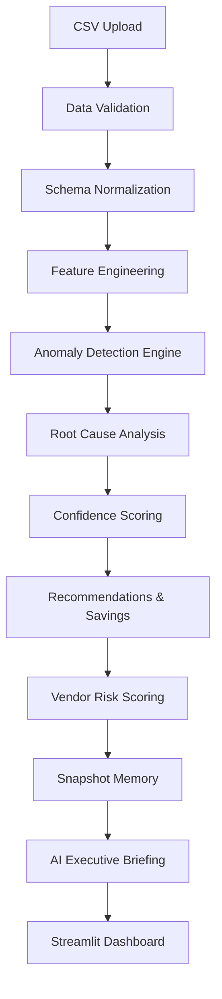
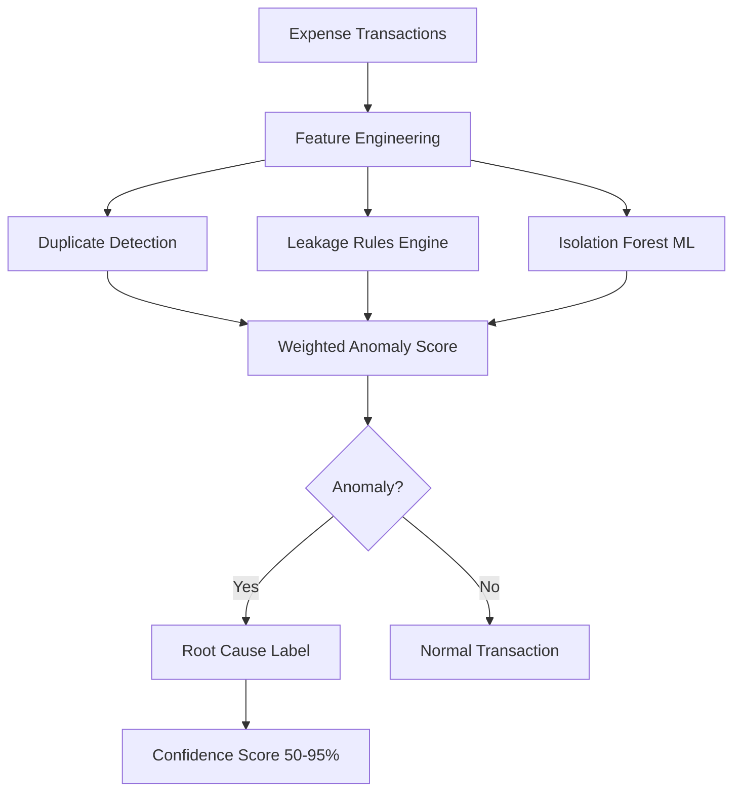

# 🔍 Agentic Cost Leakage Hunter

**Autonomous Expense Anomaly & Waste Detection System for SMBs**

Automatically detect duplicate invoices, vendor overcharging, subscription waste, and abnormal spending — all through an AI-powered dashboard.

---

## 📌 Overview

Agentic Cost Leakage Hunter is an AI-driven financial monitoring platform built for small and medium businesses.

Organizations typically lose **5–20% of annual spend** due to:

- 🔁 Duplicate invoices
- 📈 Vendor overcharging
- 🔔 Unused subscriptions
- 💥 Abnormal spending spikes
- 🎯 Statistical spending outliers

The system automatically scans expense data, flags anomalies, explains why they were flagged, and recommends corrective actions.

---

## 🏗️ System Architecture



---

## 🔬 Detection Pipeline



---

## ✨ Core Features

### 🤖 Hybrid Anomaly Detection
- Isolation Forest machine learning model
- Rule-based leakage detection
- Duplicate invoice detection
- High-value transaction guardrail
- Weighted scoring across all signals

### 🧠 Explainability Engine
- Confidence score per anomaly (50–95%)
- Step-by-step reasoning timeline
- Priority-ordered root cause labels

### 📊 Vendor Risk Index
- Composite 0–100 risk score per vendor
- Exposure ratio, anomaly frequency, root cause diversity
- Risk tiers: High / Moderate / Low

### 💾 Snapshot Memory System
- Save financial states as snapshots
- Compare current vs previous analysis
- Track new, resolved, and persisting issues

### 🤖 AI Executive Briefing
- One-click CFO-ready narrative
- Powered by Groq (LLaMA 3.1)
- MockLLM fallback if API unavailable

### 💰 Savings Estimation
- Risk-adjusted financial exposure per anomaly
- Recovery rate modeled by anomaly type
- What-if savings simulator

---

## 🖥️ Dashboard Pages

### 📊 Executive Briefing
- Total Spend, Financial Exposure, Recoverable Savings
- Financial Health Grade (A → D)
- Vendor Risk Index chart
- Snapshot delta comparison
- AI executive report

### ⚠️ Detected Issues
- Root cause breakdown by exposure
- Confidence % per issue
- AI reasoning timeline

### 📈 Business Impact
- Monthly and annualized exposure projections
- Top vendors by financial exposure

### 🧭 Evidence Story
- Per-vendor spend timeline
- Month-over-month trend chart

### 🧾 Duplicate Evidence
- Clustered duplicate invoice groups
- Duplicate exposure per vendor

### ✅ Recommended Actions
- Root-cause specific action playbook
- Estimated recoverable savings per action

---

## 💡 Financial Health Grading

| Grade | Label | Leakage % |
|---|---|---|
| A | Excellent Control | < 1% |
| B+ | Healthy Control | 1% – 3% |
| C | Moderate Risk | 3% – 6% |
| D | High Risk — Urgent Review | > 6% |

---

## 🧰 Technology Stack

### 🤖 AI Layer

| Component | Technology |
|---|---|
| ML Detection | Scikit-learn — Isolation Forest |
| LLM | Groq API (LLaMA 3.1 8B) |
| Explainability | Custom Confidence Engine |

### 🖥️ Application Layer

| Component | Technology |
|---|---|
| Dashboard | Streamlit |
| Visualization | Plotly |
| Data Processing | Pandas, NumPy |
| Config | Python-dotenv |
| Snapshot Storage | JSON File System |

---

## 📁 Project Structure

```
agentic-cost-leakage-hunter/
│
├── streamlit_app.py
├── requirements.txt
│
├── src/
│   ├── detection/
│   ├── features/
│   ├── ingestion/
│   ├── schema/
│   ├── rca/
│   ├── explainability/
│   ├── recommendations/
│   ├── memory/
│   ├── scoring/
│   ├── simulation/
│   └── validation/
│
├── data/
│   └── sample_datasets/
│
└── memory/
    └── snapshots/
```

---

## ⚙️ Setup

### 1️⃣ Clone the Repository

```bash
git clone https://github.com/yourusername/agentic-cost-leakage-hunter.git
cd agentic-cost-leakage-hunter
```

### 2️⃣ Install Dependencies

```bash
pip install -r requirements.txt
```

### 3️⃣ Create .env

```
GROQ_API_KEY=your_groq_api_key_here
LLM_MODE=groq
```

> 💡 Get a free API key at [console.groq.com](https://console.groq.com). Works without it using MockLLM fallback.

### 4️⃣ Run the Dashboard

```bash
streamlit run streamlit_app.py
```

---

## 📋 Dataset Format

Upload any expense CSV. The system auto-detects column names.

**Required columns:** `company_id`, `date`, `amount`

**Optional:** `vendor`, `category`, `units`, `unit_price`, `po_id`, `recurring`

**Supported aliases:**
```
amount    → total, txn_amount, expense, value
date      → txn_date, invoice_date, posting_date, month
vendor    → merchant, supplier, vendor_name, payee
recurring → subscription, is_recurring, auto_renew
```

---

## 🗺️ Future Enhancements

- Fuzzy vendor name matching
- Multi-company support
- Real-time expense monitoring
- Cloud deployment (AWS / GCP)
- REST API layer
- Excel / PDF report export

---

## 👤 Author

Applied AI & Data Science project demonstrating hybrid anomaly detection, explainable AI, and LLM-powered financial intelligence for SMB expense monitoring.
