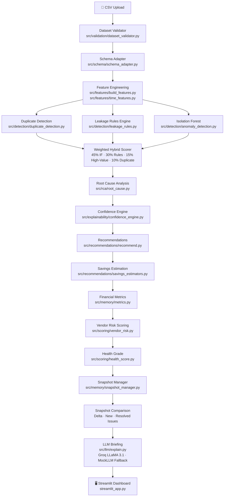
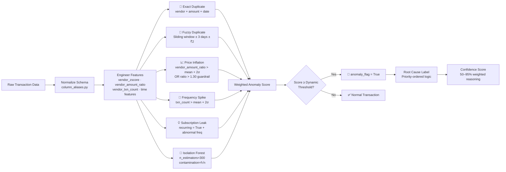
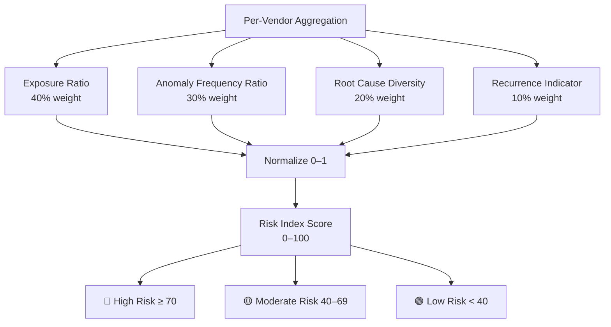
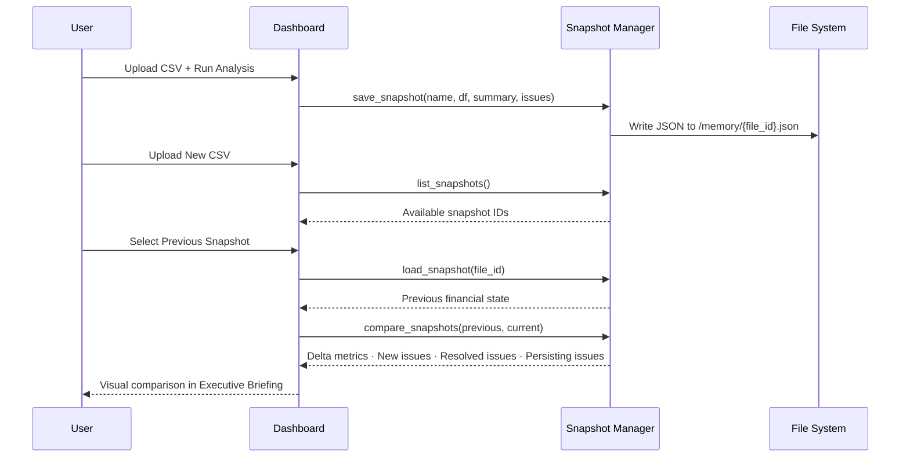
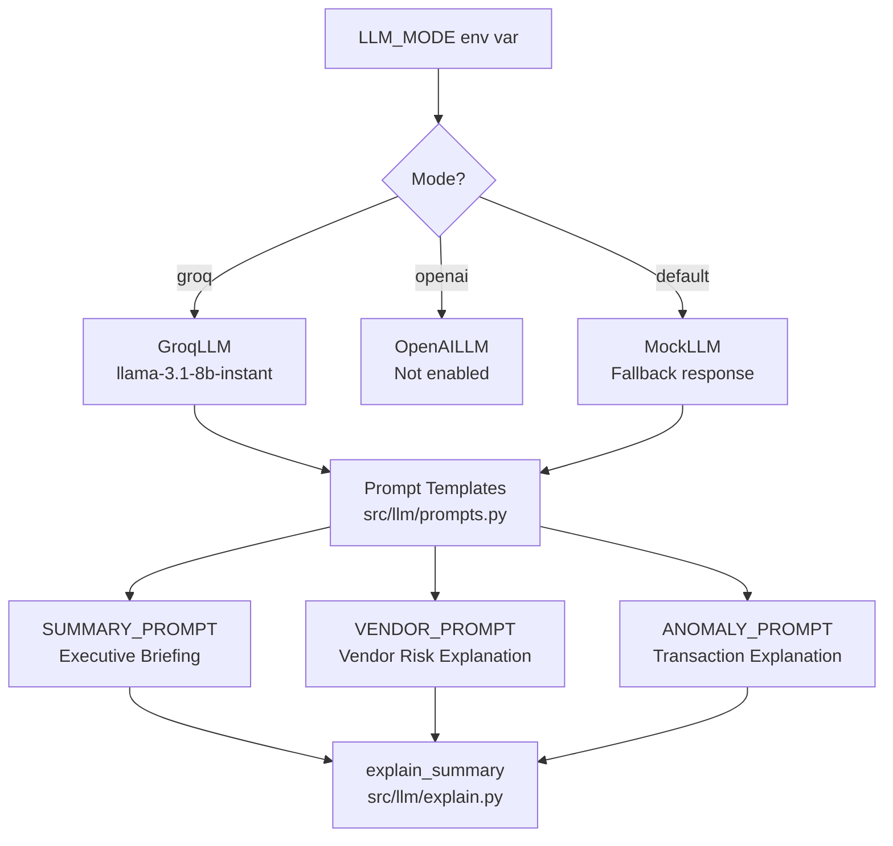

<div align="center">

# 🔍 Agentic Cost Leakage Hunter

### Autonomous Expense Anomaly & Waste Detection System for SMBs

[](https://python.org)
[](https://streamlit.io)
[](https://scikit-learn.org)
[](https://groq.com)
[](https://plotly.com)
[](LICENSE)

> **Detect hidden financial leakages, duplicate invoices, vendor overcharging, and abnormal spending patterns — automatically.**

[Features](#-features) • [Architecture](#-system-architecture) • [Pipeline](#-detection-pipeline) • [Dashboard](#-dashboard-pages) • [Setup](#-installation) • [Dataset Format](#-dataset-format)

</div>

---

## 🧠 Overview

**Agentic Cost Leakage Hunter** is an AI-driven financial intelligence platform built for small and medium businesses (SMBs). It automatically ingests expense data, runs a multi-layer anomaly detection pipeline, performs root cause analysis, and delivers actionable recommendations — all through a professional interactive dashboard.

Organizations typically lose **5–20% of annual spending** due to:

| Leakage Type | Description |
|---|---|
| 🔁 Duplicate Invoices | Same vendor + amount billed multiple times |
| 📈 Vendor Overcharging | Unit price exceeds historical baseline by >30% |
| 🔔 Subscription Waste | Recurring payments with abnormal billing frequency |
| 💥 Spending Spikes | Transaction frequency far above vendor average |
| 🎯 Statistical Outliers | ML-detected deviations from normal spending patterns |

---

## ✨ Features

- **Hybrid Anomaly Detection** — Isolation Forest (ML) + Rule-based + Duplicate + High-Value signals combined into a weighted score
- **Dynamic Contamination Rate** — Self-calibrates sensitivity based on dataset size (`2%–7%` range)
- **Root Cause Analysis** — Priority-ordered labeling of each flagged transaction
- **Confidence Engine** — Weighted reasoning timeline explaining why each anomaly was flagged
- **Vendor Risk Index** — Composite 0–100 risk score per vendor (exposure, frequency, diversity, recurrence)
- **Financial Health Grade** — Portfolio-level A/B+/C/D grading by leakage percentage
- **Savings Estimation** — Risk-adjusted exposure and recovery rate modeled per anomaly type
- **Snapshot Memory System** — Save, load, and compare financial states across time periods
- **LLM Executive Briefing** — AI-generated CFO-ready narrative via Groq (LLaMA 3.1) with MockLLM fallback
- **Schema Adapter** — Auto-normalizes 40+ column name aliases from real-world ERP/accounting exports
- **Savings Simulator** — Models optimized spend based on renegotiation and subscription cleanup actions

---

## 🏗️ System Architecture



---

## 🔬 Detection Pipeline



### Anomaly Score Formula

```
anomaly_score = (0.45 × iforest_score)
              + (0.30 × rule_score)
              + (0.15 × high_value_score)
              + (0.10 × duplicate_score)
```

| Signal | Weight | Source |
|---|---|---|
| Isolation Forest | 45% | Statistical ML outlier score |
| Rule-Based | 30% | Frequency spike + price inflation + subscription leak |
| High-Value Guardrail | 15% | Transactions above 98th percentile |
| Duplicate Score | 10% | Exact or fuzzy duplicate match |

---

## 🧮 Vendor Risk Index



---

## 💾 Snapshot Memory System



Snapshots store: financial summary, issues by root cause, exposure values, and timestamp. Comparison surfaces exposure growth, new anomaly categories, and resolved issues.

---

## 🖥️ Dashboard Pages

### 1. 📊 Executive Briefing
- Total Spend, Financial Exposure, Recoverable Savings KPIs
- Daily spend/vendor/anomaly sparklines
- Financial Health Grade (A → D)
- Vendor Risk Index bar chart
- Isolation Forest score distribution
- Snapshot delta comparison (resolved / new / persisting issues)
- **AI Executive Report** — one-click LLM narrative for CFOs

### 2. ⚠️ Detected Issues
- Root cause breakdown pie chart by exposure
- Per-issue: exposure, flagged transaction count, confidence %
- AI reasoning timeline explaining each detection signal

### 3. 📈 Business Impact
- Monthly and annualized exposure projections
- Top vendors by risk-adjusted financial exposure

### 4. 🧭 Evidence Story
- Per-vendor spend timeline chart
- Month-over-month trend visualization

### 5. 🧾 Duplicate Evidence
- Clustered duplicate invoice groups (vendor + amount)
- Scatter chart of duplicate transactions over time
- Total duplicate exposure per cluster

### 6. ✅ Recommended Actions
- Root-cause specific action playbook
- Estimated recoverable savings per action
- Action buttons: Notify Finance / Send Vendor Email / Schedule Review

---

## 🤖 LLM Integration



The LLM layer is **stateless and context-injected** — it never invents numbers and only explains data passed in structured prompts. Prompts are role-conditioned for CFO-level non-technical audiences.

---

## 📁 Project Structure

```
agentic-cost-leakage-hunter/
│
├── streamlit_app.py                  # Main dashboard entry point
├── requirements.txt
├── README.md
│
├── src/
│   ├── detection/
│   │   ├── anomaly_detection.py      # Hybrid weighted anomaly scorer (IF + rules)
│   │   ├── duplicate_detection.py    # Exact + fuzzy sliding window duplicate detector
│   │   └── leakage_rules.py          # Vendor-relative rule engine (price, frequency, subscription)
│   │
│   ├── features/
│   │   ├── build_features.py         # Vendor-level feature engineering (zscore, ratio, count)
│   │   └── time_features.py          # Date parsing → year, month, year_month
│   │
│   ├── ingestion/
│   │   ├── load_data.py              # CSV loader with schema validation
│   │   ├── normalise.py              # Column alias mapper + type coercion
│   │   └── schema.py                 # Required column contract
│   │
│   ├── schema/
│   │   ├── canonical_schema.py       # 14-column canonical schema definition
│   │   ├── column_aliases.py         # 40+ real-world column name aliases
│   │   └── schema_adapter.py         # Full normalization pipeline with signal flags
│   │
│   ├── rca/
│   │   └── root_cause.py             # Priority-ordered root cause labeler
│   │
│   ├── explainability/
│   │   └── confidence_engine.py      # Weighted confidence score + reasoning steps
│   │
│   ├── recommendations/
│   │   ├── recommend.py              # Root-cause → action + priority mapper
│   │   └── savings_estimators.py     # Risk-adjusted exposure + recovery rate calculator
│   │
│   ├── memory/
│   │   ├── anomaly_log.py            # Anomaly lifecycle initialization (UUID, status)
│   │   ├── decision_log.py           # Status updater (new → confirmed → recovered)
│   │   ├── metrics.py                # Financial summary, vendor exposure, monthly trends
│   │   ├── snapshot_manager.py       # Save/load/compare JSON snapshots
│   │   └── vendor_memory.py          # Company-scoped snapshot storage
│   │
│   ├── scoring/
│   │   ├── health_score.py           # Portfolio health grade (A → D) by leakage %
│   │   └── vendor_risk.py            # Composite vendor risk index (0–100)
│   │
│   ├── simulation/
│   │   └── savings_simulation.py     # What-if savings simulator
│   │
│   └── validation/
│       └── dataset_validator.py      # Pre-pipeline data quality checks
│
├── data/
│   └── sample_datasets/              # Example CSV files
│
└── memory/
    └── snapshots/                    # Auto-generated JSON snapshot files
```

---

## ⚙️ Installation

**1. Clone the repository**
```bash
git clone https://github.com/yourusername/agentic-cost-leakage-hunter.git
cd agentic-cost-leakage-hunter
```

**2. Create a virtual environment**
```bash
python -m venv venv
source venv/bin/activate        # macOS/Linux
venv\Scripts\activate           # Windows
```

**3. Install dependencies**
```bash
pip install -r requirements.txt
```

**4. Configure environment variables**
```bash
cp .env.example .env
```

Edit `.env`:
```env
GROQ_API_KEY=your_groq_api_key_here
LLM_MODE=groq          # groq | mock
```

> 💡 Get a free Groq API key at [console.groq.com](https://console.groq.com). The system works fully without it using `MockLLM` fallback.

**5. Run the dashboard**
```bash
streamlit run streamlit_app.py
```

Open [http://localhost:8501](http://localhost:8501) in your browser.

---

## 📋 Dataset Format

The system auto-normalizes column names from real-world ERP, accounting, and procurement exports. The only **required columns** are:

| Column | Required | Description |
|---|---|---|
| `company_id` | ✅ | Business/organization identifier |
| `date` | ✅ | Transaction date |
| `amount` | ✅ | Transaction amount |
| `vendor` | Optional | Merchant/supplier name |
| `category` | Optional | Expense category |
| `units` | Optional | Quantity (defaults to 1) |
| `unit_price` | Optional | Price per unit |
| `po_id` | Optional | Purchase order / invoice number |
| `recurring` | Optional | Boolean subscription flag |

**Supported column aliases** — the schema adapter recognizes 40+ variations:

```
amount     → total, txn_amount, expense, value, net_amount
date       → txn_date, invoice_date, posting_date, order_date, period, month
vendor     → merchant, supplier, vendor_name, payee
recurring  → subscription, is_recurring, auto_renew
```

### Example CSV

```csv
company_id,date,vendor,category,amount,units,unit_price,recurring
ACME_001,2024-01-15,Microsoft Azure,Cloud,12500.00,1,12500.00,TRUE
ACME_001,2024-01-15,Microsoft Azure,Cloud,12500.00,1,12500.00,TRUE
ACME_001,2024-01-18,Zoom,SaaS,899.00,1,899.00,TRUE
ACME_001,2024-01-22,Office Depot,Supplies,4200.00,10,420.00,FALSE
```

---

## 📐 Financial Health Grading

| Grade | Label | Leakage % |
|---|---|---|
| **A** | Excellent Control | < 1% |
| **B+** | Healthy Control | 1% – 3% |
| **C** | Moderate Risk | 3% – 6% |
| **D** | High Risk — Urgent Review | > 6% |

---

## 🗺️ Roadmap

- [ ] Fuzzy vendor name matching (Levenshtein distance)
- [ ] Multi-company / multi-tenant support
- [ ] Real-time expense stream monitoring (Kafka / webhook)
- [ ] Vendor behavior profiling over rolling windows
- [ ] Automated vendor negotiation agent
- [ ] Cloud deployment (AWS / GCP / Azure)
- [ ] REST API layer (FastAPI — scaffold already in `requirements.txt`)
- [ ] Excel / PDF report export

---

## 🧰 Tech Stack

| Layer | Technology |
|---|---|
| **Dashboard** | Streamlit |
| **ML Detection** | Scikit-learn — Isolation Forest |
| **Data Processing** | Pandas, NumPy |
| **Visualization** | Plotly |
| **LLM** | Groq API (LLaMA 3.1 8B Instant) |
| **Snapshot Storage** | JSON file system |
| **API Scaffold** | FastAPI + Uvicorn |
| **Config** | Python-dotenv |

---

## 👤 Author

Developed as a data science project applying hybrid anomaly detection, explainable AI, and LLM-powered financial intelligence to the real-world problem of cost leakage in small and medium businesses.

---

<div align="center">

**⭐ Star this repo if you found it useful**

</div>
